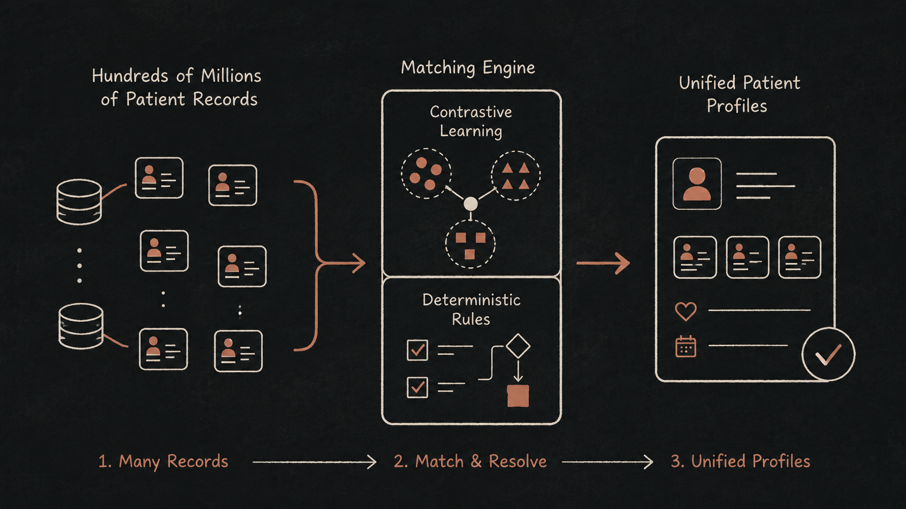
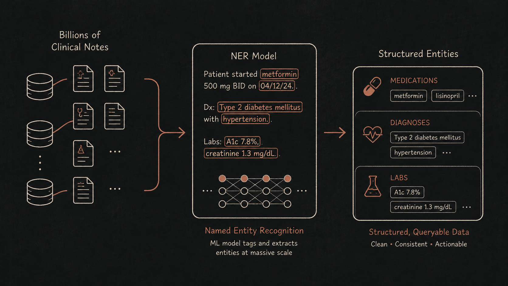
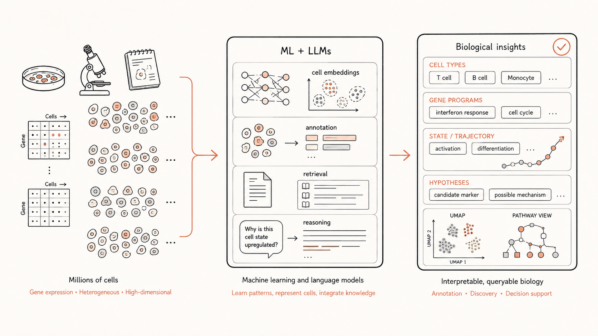
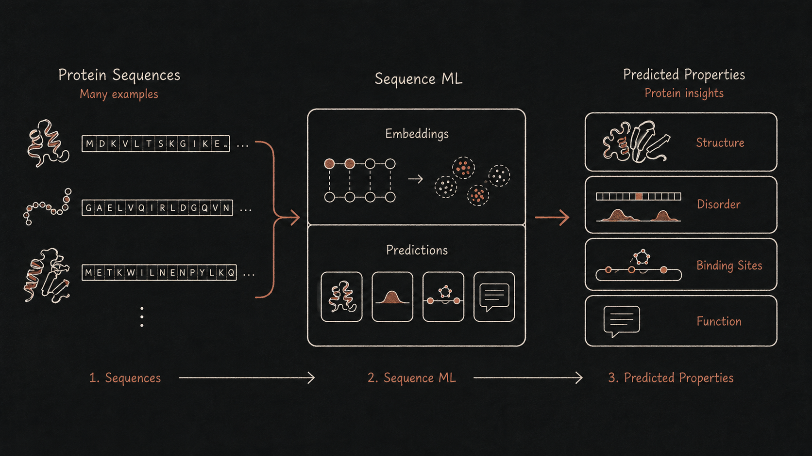

Selected work, grouped by area — from current large-scale clinical NLP back to PhD-era protein bioinformatics.

## Entity Resolution on 100s of millions of patient records

Linking records that belong to the same person across health systems is what makes longitudinal, de-duplicated patient data possible — and it has to survive misspellings, formatting drift, name changes, and missing fields at production scale.

> **2026 — Linking patient records at scale with a hybrid approach combining contrastive learning and deterministic rules** — [Biology Methods and Protocols](https://doi.org/10.1093/biomethods/bpag009)
>
> A BERT-based Siamese encoder fine-tuned with a contrastive objective turns noisy PII into embeddings where matching records sit close together; the vectors are clustered into "fuzzy IDs" and combined with deterministic rules. The hybrid beats strict token matching on recall and permissive matching on precision, and runs in production over more than 200 million records.

## Named Entity Recognition on billions of clinical notes

Free-text clinical notes hold much of the signal in the medical record. This line of work extracts structured information from notes at the scale of billions of documents, where evaluation quality and cost per note dominate every design decision.

> **In progress — PHI de-identification with LLMs and optimized guidelines**
>
> Detecting and removing protected health information (PHI) from clinical notes at scale. The interesting part is the workflow: the annotation guideline that steers the LLM is treated as an optimizable artifact — expressed as a [DSPy](https://dspy.ai/) program and refined with reflective prompt evolution ([GEPA](https://arxiv.org/abs/2507.19457)) against labeled evaluation sets — so guideline changes are measured rather than argued about.

## Machine Learning and Large Language Models (LLMs) in single-cell biology

Applying language models and perturbational analysis to single-cell transcriptomics — from teaching LLMs to read gene expression to mapping how patient tumors resist immunotherapy.

> **2025 — Perturbational single-cell RNA sequencing of patient tumors in Merkel cell and small cell lung carcinomas** — [Journal of Clinical Oncology](https://doi.org/10.1200/JCO.2025.43.16_suppl.2520)
>
> Patient tumor samples treated ex vivo and read out with perturbational single-cell RNA-seq show that Merkel cell carcinoma blunts innate-immune (interferon) responses that melanoma retains — and pin the cytokine midkine (MDK) as a driver: knocking it out restores responsiveness in MCC and SCLC models.

> **2024 — Cell2Sentence: Teaching Large Language Models the Language of Biology** — [ICML 2024](https://proceedings.mlr.press/v235/levine24a.html)
>
> C2S turns single-cell gene-expression profiles into "cell sentences" so ordinary language models can be fine-tuned on them directly. Fine-tuned models generate biologically valid cells from a cell-type prompt, annotate cell types, and keep their text abilities.

## Sequence-based machine learning for protein structure, disorder, binding, and function

PhD-era work with the Kurgan Lab at VCU: predicting structure, disorder, binding, and function directly from protein sequence, with several tools validated in the community-run CAID assessment.

> **2023 — Comparative evaluation of AlphaFold2 and disorder predictors for prediction of intrinsic disorder, disorder content and fully disordered proteins** — [Computational and Structural Biotechnology Journal](https://doi.org/10.1016/j.csbj.2023.06.001)
>
> Benchmarks AlphaFold2's pLDDT-derived disorder signal against 20 dedicated predictors on a 646-protein set: AF2 is respectable (AUC 0.77) but slower and less accurate than modern disorder predictors, winning mainly on short, mostly-ordered proteins.

> **2023 — Tutorial: a guide for the selection of fast and accurate computational tools for the prediction of intrinsic disorder in proteins** — [Nature Protocols](https://doi.org/10.1038/s41596-023-00876-x)
>
> A practitioner's guide to choosing among 23 publicly available disorder predictors, using CAID results to weigh accuracy against runtime — with concrete picks like flDPnn (accurate and fast) and IUPred (very fast).

> **2021 — DNAgenie: accurate prediction of DNA-type-specific binding residues in protein sequences** — [Briefings in Bioinformatics](https://doi.org/10.1093/bib/bbab336)
>
> The first predictor to distinguish residues that bind A-DNA, B-DNA, and single-stranded DNA, with a refinement step that cuts cross-prediction; a scan of the human proteome surfaces several hundred putative new DNA-binding proteins.

> **2021 — XRRpred: accurate predictor of crystal structure quality from protein sequence** — [Bioinformatics](https://doi.org/10.1093/bioinformatics/btab509)
>
> The first tool to predict crystal-structure quality — resolution and R-free — directly from sequence, so crystallography targets can be triaged before the experiment; outperforms crystallization-propensity and alignment-based alternatives.

> **2021 — flDPnn: Accurate intrinsic disorder prediction with putative propensities of disorder functions** — [Nature Communications](https://doi.org/10.1038/s41467-021-24773-7)
>
> Predicts intrinsic disorder together with four common disorder functions from sequence alone; in the community-run CAID experiment and further independent tests it was substantially more accurate than existing predictors while staying fast.

> **2021 — QUARTERplus: Accurate disorder predictions integrated with interpretable residue-level quality assessment scores** — [Computational and Structural Biotechnology Journal](https://doi.org/10.1016/j.csbj.2021.04.066)
>
> A deep-learning meta-model that uses residue-level quality-assessment scores to find and repair weak regions in disorder predictions — AUC 0.93, statistically ahead of twelve state-of-the-art predictors, with interpretable per-residue confidence.

> **2020 — Prediction of protein-binding residues: dichotomy of sequence-based methods developed using structured complexes versus disordered proteins** — [Bioinformatics](https://doi.org/10.1093/bioinformatics/btaa573)
>
> Shows that binding-residue predictors trained on structured complexes and those trained on disordered proteins each fail on the other's annotation type, then combines the two families (hybridPBRpred) to cover both with low cross-prediction.

> **2020 — Disordered Function Conjunction: On the in-silico function annotation of intrinsically disordered regions** — [Pacific Symposium on Biocomputing 2020](https://doi.org/10.1142/9789811215636_0016)
>
> Tests the feasibility of aggregating residue-level predictions into region-level functional annotations for intrinsically disordered regions — the granularity at which thousands of discovered IDRs actually need labels.

> **2019 — Sequence-derived markers of drug targets and potentially druggable human proteins** — [Frontiers in Genetics](https://doi.org/10.3389/fgene.2019.01075)
>
> Derives markers computable from sequence and identifiers alone — intrinsic disorder, conservation, alternative splicing, domains, solvent accessibility, network and localization features — that separate known drug targets from non-druggable proteins across the human proteome.

> **2019 — Computational prediction of functions of intrinsically disordered regions** — [Progress in Molecular Biology and Translational Science](https://doi.org/10.1016/bs.pmbts.2019.04.006)
>
> A survey of 25 computational methods for predicting the functions of intrinsically disordered regions, motivated by the gap between how abundant IDRs are and the few hundred with annotated function.
